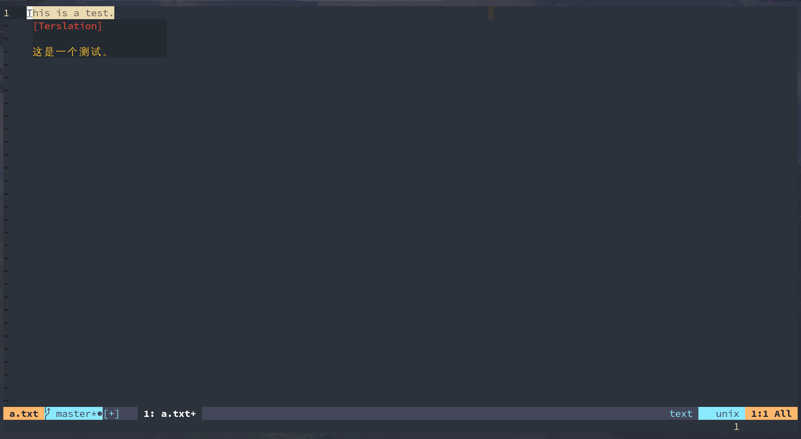

## Terslation.vim

[English README](./README_CN.md)  
[Gitee 仓库](https://gitee.com/springhan/Terslation.vim)  
[Github 仓库](https://github.com/SpringHan/Terslation.vim)

### 截图




### 简介

Terslation.vim是终端翻译器的Vim交互界面。你可以通过它来使Terslation用得更舒服。

### 安装

此插件依赖于 [Terslation](https://github.com/denstiny/Terslation)，所以你应该先安装它。
可以使用 [vim-plug](https://github.com/junegunn) 来安装:

```vim
Plug 'denstiny/Terslation'
Plug 'SpringHan/Terslation.vim'
```

然后，你需要跳转到 `Terslation` 的目录下并执行`sudo make install`。

### 用法

你可以通过在Vim运行`:help terslation`来获取帮助，或者运行`:help terslation@cn`来获取中文文档。

## 证书
MIT
